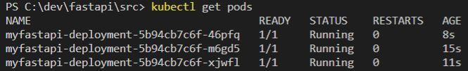

# FAST API

[[_TOC_]]

Just trying out fastapi to see how easy it really is to get up and running with and how nice it is to use.

Tutorials and documentation can be found here [https://fastapi.tiangolo.com/](https://fastapi.tiangolo.com/)

## System

Just using my Windows 10 host machine for playing about with this.

## Install Python

I used chocolately but you can install in lots of other ways of course

```cmd
choco install python
```

## Install PIP

Check that you have `python` installed first as you will need this

```cmd
python help
```

You can get pip from here, its a `py` file, download and run the following

```cmd
python get-pip.py
```

_make sure you add pip directory to your `path` which should be in your scripts folder where python was installed. I had to restart terminal before it recognised the command ;-)_

## Instal fastapi and uvicord

Using the now installed `pip` you can run the following command to install fastapi

```cmd
pip install fastapi
```

then

```cmd
pip install uvicorn
```

## Running the sample API

Now for the fun bit, run the API with the following command

```cmd
uvicorn main:app --reload
```

`main` is the file while `app` is the variable that we assigned `fastAPI()` to

## Docker & Kubernetes

### Docker 

Goto the `src` folder where the `Dockerfile` is located and run the following to build the image

```docker
docker build -t myfastapi .
```

`myfastapi` is the image name we will give

Now start the Docker container and test out the API

```
docker run -d --name myfastapicontainer -p 80:80 myfastapi
```

### Kubernetes

Hopefully if you followed previous step you will have an image created for your fastapi application.
Now we want to use that image with kubernetes. I pushed my local image to my dockerhub repository, do this to follow the next step

You can then use the `definition.yml` file in the `/src` folder and run the following

```
kubectl apply -f definition.yml
```

Now run the following command and you should see we have 3 pods running our fastapi!!!

```
kubectl get pods
```

You should now see this

